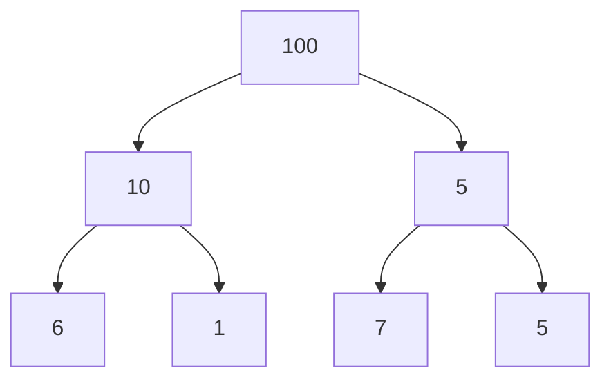

# Bootcamp Santander Coders 2024 | Back-End | Ada.Tech
Repositório com os materiais de estudo do bootcamp Santander | Coders 2024 da plataforma Ada.Tech

## Módulos
### Introdução à Estrutura de Dados
* [Supermarket](src/main/java/Supermarket) - Implementação de um array;
* [Linkedlist](src/main/java/edu/tiago/dataStructure/Linkedlist.java) - Implementação de uma lista encadeada;
* [Stack](src/main/java/edu/tiago/dataStructure/Stack.java) - Implementação de uma pilha
* [main](src/main/java/edu/tiago/dataStructure/Main.java) - Problema: Utilizando um pilha, inverta um conjunto de dados fornecido pelo usuário
* [Queue](src/main/java/edu/tiago/dataStructure/Queue.java) - Implementação de fila
* [FilaDeAtendimento](src/main/java/edu/tiago/dataStructure/FilaDeAtendimento.java) - Problema: Simulador de fila de atendimento
* [Tree](src/main/java/edu/tiago/dataStructure/Tree.java) - Implementação de uma árvore
* [BST](src/main/java/edu/tiago/dataStructure/BST.java) - Implementação de árvore binária de busca

#### Resolvendo problemas
* [Balanceamento de colchetes em uma expressão](src/main/java/edu/tiago/dataStructure/problemas/BalanceamentoDeColchetes.java)
```bash
Dada uma string de expressão exp, escreva um programa para examinar se os pares e as ordens de "{", "}", "(", ")", "[", 
"]" estão corretos na expressão dada.

Exemplo 1: 2*(3+4+5*[2+3)]
Exemplo 2: 2*(3+4+5*[2+3])
Exemplo 3: [2*(3+4+5[2+3]/(2+(3+(7+5)*9)*6)*[5+8]+17)+2]
```
* [Revertendo os primeiros elementos de uma fila](src/main/java/edu/tiago/dataStructure/problemas/FilaReversa.java)
```bash
Dado um inteiro k e uma fila de inteiros, a tarefa é inverter a ordem dos primeiros k elementos 
da fila, deixando os demais elementos na mesma ordem relativa.

Exemplo 1: [1, 2, 3, 4, 5] -> K = 2 -> [2, 1, 3, 4, 5]
Exemplo 2: [1, 2, 3, 4, 5] -> K = 4 -> [4, 3, 2, 1, 5]
```
* [Maior valor em cada nível da árvore binária](src/main/java/edu/tiago/dataStructure/problemas/LargestTreeValues.java)
```bash
Dada uma árvore binária, encontre o maior valor em cada nível conforme o gráfico abaixo

Exemplo lista: [100, 10, 5, 6, 1, 7, 5]
A resposta deve ser: [100, 10, 7]

```
